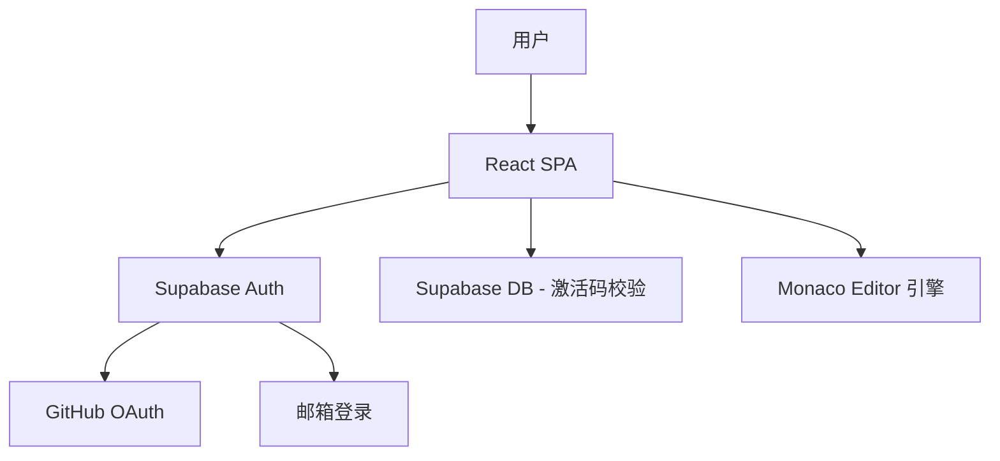
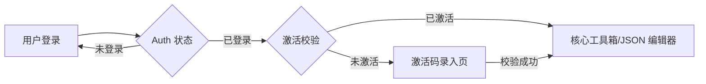

## 产品概述

GeekToolbox 是一款专为开发者设计的极简主义工具箱。它采用高对比度的极简视觉风格，集成专业的 JSON 编辑器，并通过 Supabase 提供安全的身份验证与全站激活码强制校验机制，确保核心工具的专属访问体验。

## 核心功能

- **多渠道登录**：集成 Supabase Auth，支持 GitHub 第三方授权登录及传统的邮箱密码登录。
- **强制激活系统**：登录后自动校验激活状态。未激活用户将被强制重定向至激活页，拦截所有核心功能模块。
- **通用激活码校验**：采用管理员在 Supabase 后台预设的通用激活码机制，支持一码多用校验。
- **Monaco JSON 编辑器**：集成 VS Code 同款 Monaco Editor，提供 JSON 语法高亮、格式化、树形视图预览及实时校验。
- **极简深邃视觉**：全站采用深邃黑 (#000000) 背景，点缀荧光绿 (#74E874) 交互元素，配合大号斜体标题，营造极客氛围。

## 技术栈

- **前端框架**: React (Vite) + TypeScript
- **状态管理**: Context API 或 Zustand (处理 Auth 与激活状态)
- **UI 库**: Tailwind CSS + shadcn/ui + Lucide React (图标)
- **动画**: Framer Motion
- **后端服务**: Supabase (PostgreSQL + Auth)
- **编辑器核心**: @monaco-editor/react

## 系统架构

## 数据流

## 设计方案

设计风格定义为“极客深邃黑” (Deep Geek Black)。整体界面采用纯黑背景，旨在消除视觉干扰，通过荧光绿 (#74E874) 的边框、阴影和文字点缀来引导视觉重心。

- **布局设计**：采用侧边栏或顶部极简导航。页面标题使用大号、斜体、加粗的 Montserrat 字体，营造速度感与技术感。
- **交互效果**：使用 Framer Motion 实现丝滑的页面切换动画。按钮和输入框在悬停时产生荧光绿的流光效果 (Glow Effect)。
- **编辑器体验**：JSON 编辑器占据页面主体，采用深色主题，左侧为代码编辑区，右侧支持实时格式化后的树形结构预览。
- **激活拦截**：激活页采用玻璃拟态 (Glassmorphism) 卡片居中显示，背景带有微弱的荧光粒子动画。

## 代理扩展

### 子代理

- **code-explorer** (来自 &lt;subagent&gt;)
- 目的：扫描当前工作目录，确保在初始化项目时不会覆盖现有代码，并根据已有结构调整配置文件。
- 预期结果：提供当前工作目录的文件结构分析报告。