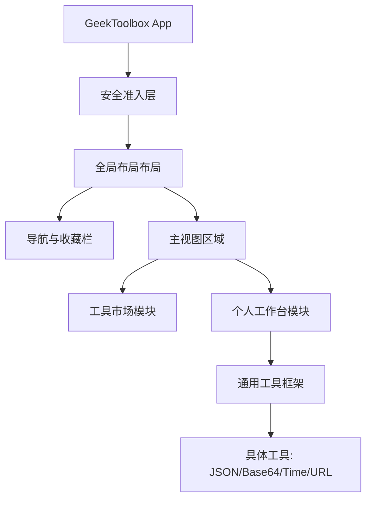
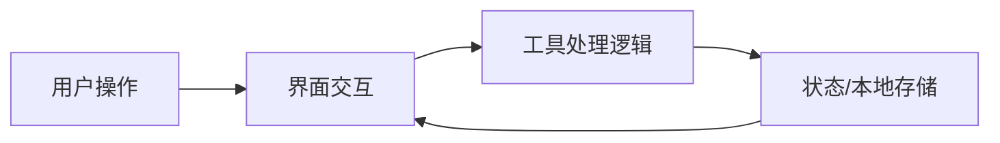

## 产品概述

GeekToolbox 是一个专为程序员打造的模块化工具箱，采用“工具市场 + 个人工作台”模式。通过统一的工具框架，用户可以快速访问 JSON 编辑器、Base64 编解码、时间戳转换等常用功能。系统强调极简、高效，视觉上采用高对比度的极客黑绿风格，并严格实施登录与激活码准入机制。

## 核心功能

- **安全准入系统**：全站强制登录，并集成激活码校验流程，确保只有获得授权的用户才能进入工具空间。
- **工具市场与工作台**：
- **市场模式**：浏览、预览并收藏各类开发工具。
- **工作台模式**：展示用户已收藏的常用工具，支持拖拽排序。
- **JSON 专业编辑器**：支持语法高亮、格式化、压缩、树状视图查看及错误校验。
- **通用工具集**：
- **编解码器**：Base64 字符串与图片互转、URL 编码/解码。
- **时间转换**：Unix 时间戳与人类可读日期互转，支持多格式输出。
- **模块化框架**：统一的输入/输出 UI 规范，允许未来通过标准接口快速接入新工具。

## 视觉效果

- **极客视觉**：背景采用深邃黑 (#000000)，文字与边框采用荧光绿 (#00FF00)，呈现复古终端与赛博朋克结合的质感。
- **动效交互**：工具切换时的淡入淡出效果，以及操作成功后的绿色微震动反馈。

## 技术栈

- **前端框架**: Next.js (React) + TypeScript
- **样式处理**: Tailwind CSS (自定义黑绿主题)
- **UI 组件库**: Radix UI (通过 shadcn/ui 集成)
- **代码编辑器**: Monaco Editor (JSON 编辑核心)
- **状态管理**: Zustand (用于管理工具收藏与工作台状态)
- **数据存储**: LocalStorage (持久化用户配置)

## 系统架构

## 数据流向

## 设计方案

设计风格定义为“Terminal Minimalist”。界面以深黑色背景为主，所有交互元素（如按钮、边框、光标）均使用明亮的荧光绿。布局采用侧边栏固定、右侧内容动态切换的模式，确保多工具切换的效率。

### 页面块设计

- **身份校验块**：全屏黑色背景，中心显示简约的激活码输入框，带有绿色扫描线扫描效果。
- **全局导航块**：侧边栏垂直排列工具图标，底部显示用户信息与设置入口。
- **工具主界面**：左右布局，左侧为输入区（Monaco Editor），右侧为输出/转换区，中间为转换控制按钮。
- **工具卡片市场**：网格布局，每张卡片展示工具名及简短描述，鼠标悬浮时产生绿色辉光效果。

## 代理扩展

### SubAgent

- **code-explorer** (来自 &lt;subagent&gt;)
- 目的：扫描当前工作目录，确保项目结构符合 Next.js 规范，并识别已有的配置文件。
- 预期结果：提供当前代码库的完整概览，辅助定位需要修改的文件。